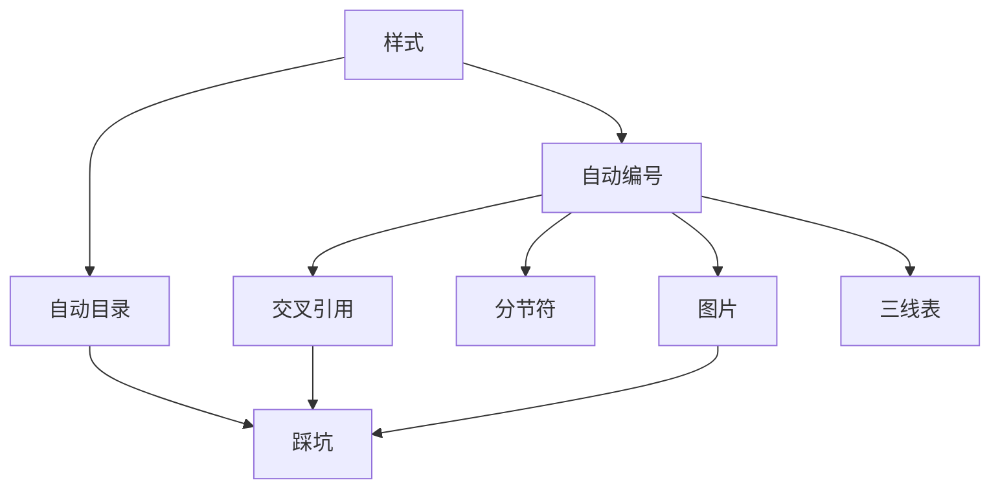

&emsp;&emsp;这是我毕业论文写作排版过程总结出来的经验，里面的所有内容都是针对毕业论文排版的。如果想要独立完成论文排版，这里介绍的word技能都是必备的。



推荐阅读顺序：



```mermaid
graph TD
样式 --> 自动目录 --> 踩坑
样式 --> 自动编号 --> 交叉引用 --> 踩坑
自动编号 --> 分节符
自动编号 --> 图片 --> 踩坑
自动编号 --> 三线表
```

