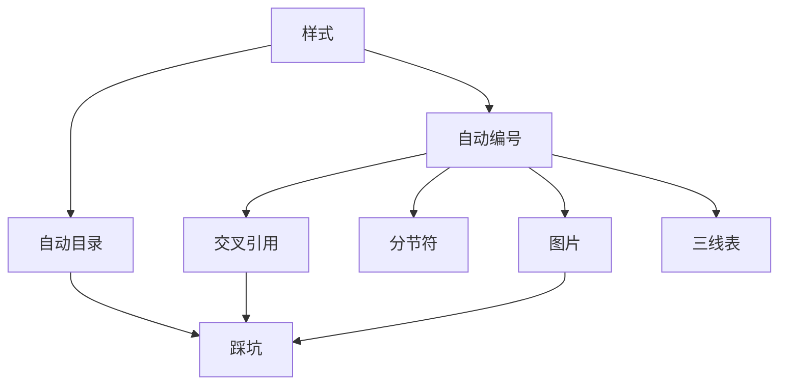

&emsp;&emsp;这是我毕业论文写作排版过程总结出来的经验，里面的所有内容都是针对毕业论文排版的。如果想要独立完成论文排版，这里介绍的 word 技能都是必备的。

> 1. 本文所有的演示、截图都是在 Office 365 上进行的。
> 2. 工欲善其事必先利其器，请保证你的 Office 版本为最新（至少 Office 2019）。
> 3. 推荐组队订阅 Office 365 家庭版，平均每人 40 元左右，还附带 1TB 的 Onedrive。



推荐阅读顺序：



