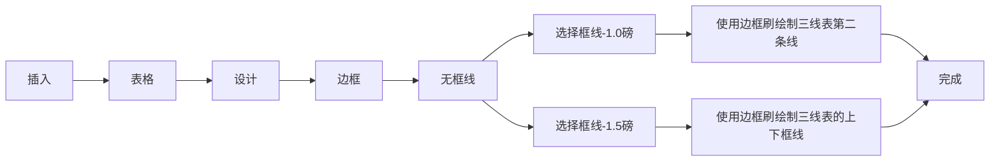



相关内容：[表格自动编号](/论文排版指南/自动编号/表格.html)



### 效果示例

### 设置过程

.gif)

```mermaid
graph LR
插入 --> 表格 --> 设计 --> 边框 --> 无框线 --> 选择框线-1.0磅 --> 使用边框刷绘制三线表第二条线 --> 完成
无框线 --> 选择框线-1.5磅 --> 使用边框刷绘制三线表的上下框线 --> 完成
```

