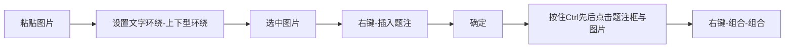



相关内容：[图片自动编号](/论文排版指南/自动编号/图片.html)



### 基础

&emsp;&emsp;插入图片后第一件事就是设置`文字环绕`。

### 组合

&emsp;&emsp;将题注与图片组合到一起，避免每次移动图片后还要回来拖题注。

.gif)

### 进阶：锚点

&emsp;&emsp;选中图片后可以看到一个蓝色的锚，这就是锚点：

&emsp;&emsp;在word中，图片通过锚点依附在文字段落上，可以将图片视为这个段落的一部分。

锚点一个很重要的特性是：图片和锚点所在的段落必须处于同一页，这这一特性导致了下面动图中的问题。

.gif)
&emsp;&emsp;动图中，在移动图片到下一页之后，原来那一页就出现了大块的空白，并且无法选中无法编辑。这是因为图片锚点将本该存在于空白处的段落固定在图片所在的页面。只要将锚点移动到后续段落，即可将本该存在于空白处的段落释放。

锚点还会影响图片的自动编号顺序，当同一页面内存在多张图片时，建议手动调整锚点的排序以保证图片编号正确。


.gif)

> 锚点是图片使用过程中必须理解的概念。理解它之后可以解决很多问题，这个过程必须自己动手。光看动图是很难理解的。

