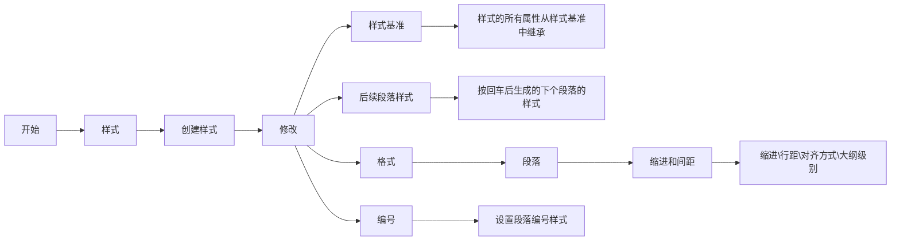

样式是论文排版的基础，也是一切排版的前提。

### 效果示例

.gif>)

### 创建样式

.gif>)

&emsp;&emsp;下面介绍创建样式的过程以及部分常用设置项。



在样式创建和修改过程中有以下几点必须注意：

1. 论文标题样式请直接在 word 默认提供的`标题1`的基础上修改，**不要创建新的标题样式**。因为只有 word 默认标题样式能够提供完整的自动编号功能。
2. word 默认提供的`正文`样式是几乎所有样式的`样式基准`（用 IT 行业的话来说就是大多数样式`继承`了`正文`，对`正文`的修改会直接影响到这些样式）。所以**不要修改`正文`样式！不要修改`正文`样式！不要修改`正文`样式！**



### 查看所有样式

&emsp;&emsp;word 默认隐藏了部分不常用的样式，这些样式可通过下面动图中的方法查看。

.gif)

### 英文、数字换行

.gif>)

> 在论文中请不要直接对**正文段落样式**设置英文换行。一般来说英文单词是不允许换行打断的。只有在示例中这样非常影响显示效果的才要打断。
