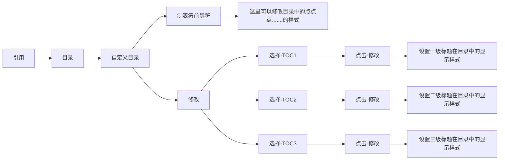

&emsp;&emsp;因为毕业论文对目录的格式也有要求。这里的重点是说明如何修改自动目录的样式。

> GIF是为了告诉你在哪里修改自动目录样式，我在里面设置的样式是为了凸显修改的效果，实际样式请按照学校的要求来。

.gif)

```mermaid
graph LR
引用 --> 目录 --> 自定义目录
自定义目录 --> 制表符前导符 --> 这里可以修改目录中的点点点.......的样式
自定义目录 --> A[修改]
A[修改] --> 选择-TOC1 --> B[点击-修改] --> 设置一级标题在目录中的显示样式
A[修改] --> 选择-TOC2 --> C[点击-修改] --> 设置二级标题在目录中的显示样式
A[修改] --> 选择-TOC3 --> D[点击-修改] --> 设置三级标题在目录中的显示样式
```

