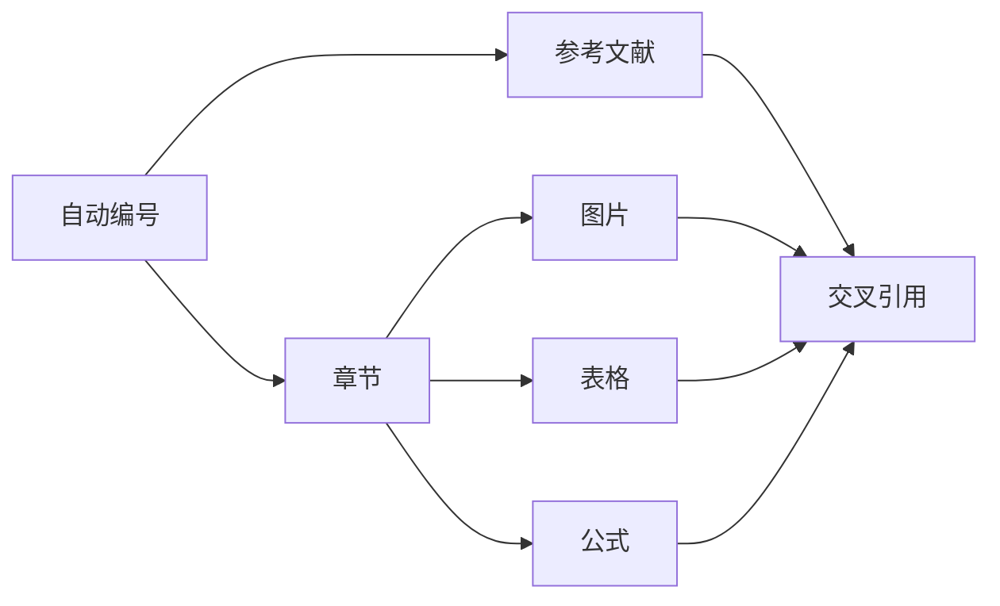

&emsp;&emsp;请不要因为自动编号设置过程麻烦就放弃它，自动编号能给你节省很多检查论文的时间。哪怕是花上一整天搞懂自动编号也绝对是值得的。

推荐阅读顺序：

```mermaid
graph LR
自动编号 --> 章节
自动编号 --> 参考文献 --> 交叉引用
章节 --> 图片 --> 交叉引用
章节 --> 表格 --> 交叉引用
章节 --> 公式 --> 交叉引用
```



章节自动编号是图片、表格、公式自动编号的前提。一定要先实现章节自动编号再看后面的。


