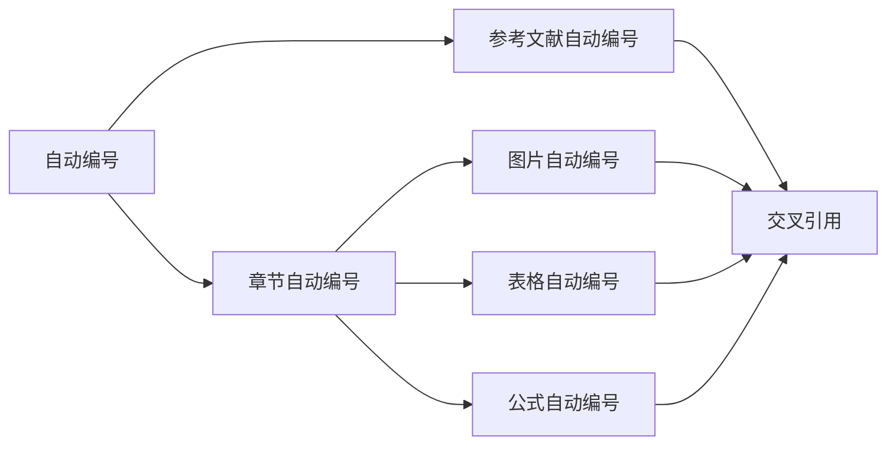



请不要因为自动编号设置过程麻烦就放弃它，自动编号能给你节省很多检查论文的时间。哪怕是花上一整天搞懂自动编号也绝对是值得的。



推荐阅读顺序：

```mermaid
graph LR
自动编号 --> 章节自动编号
自动编号 --> 参考文献自动编号 --> 交叉引用
章节自动编号 --> 图片自动编号 --> 交叉引用
章节自动编号 --> 表格自动编号 --> 交叉引用
章节自动编号 --> 公式自动编号 --> 交叉引用
```



[章节自动编号](/论文排版指南/自动编号/章节.html)是图片、表格、公式自动编号的前提。一定要先实现[章节自动编号](/论文排版指南/自动编号/章节.html)再看其它的。


