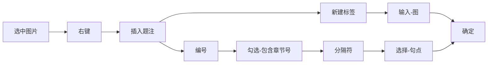



图片按章节自动编号的前提是正确设置了[章节自动编号](/论文排版指南/自动编号/章节.html)


### 效果示例

.gif)

### 设置过程

.gif)

```mermaid
graph LR
选中图片 --> 右键 --> A[插入题注]
A --> 新建标签 --> 输入-图 --> 确定
A --> 编号 --> 勾选-包含章节号 --> 分隔符 --> 选择-句点 --> 确定
```

