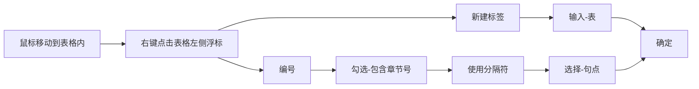


请在[章节自动编号](/论文排版指南/自动编号/章节.html)设置成功后阅读本文


### 效果示例

.gif)

### 设置过程

.gif)

```mermaid
graph LR
鼠标移动到表格内 --> A[右键点击表格左侧浮标]
A --> 新建标签 --> 输入-表 --> 确定
A --> 编号 --> 勾选-包含章节号 -->使用分隔符 --> 选择-句点 --> 确定
```

